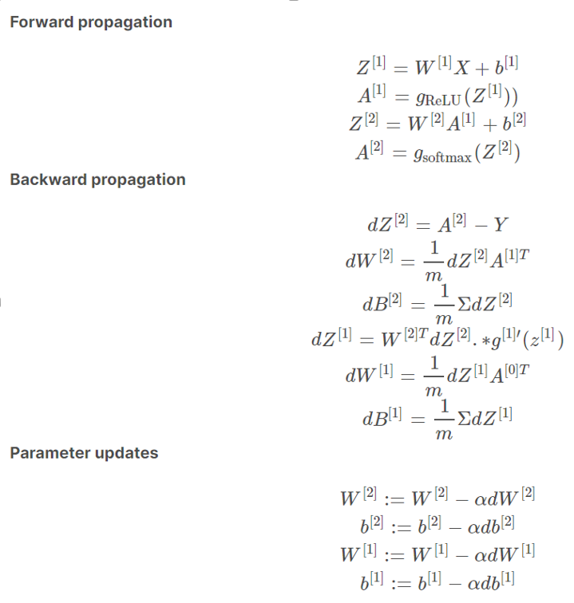

# Intern Project Plan

## Company
Shenzhen DeepVision Innovation Technology Co., Ltd

http://www.deepvai.com/en/index.html


https://github.com/bentrevett/pytorch-image-classification

https://heartbeat.fritz.ai/basics-of-image-classification-with-pytorch-2f8973c51864

https://www.youtube.com/watch?v=aircAruvnKk
## 8 Weeks Plan
* 2 weeks to learn related skills
* 4 weeks to do real work
* 2 weeks to wrap up

## 1st week
* Learn GIT. Follow tutorial to learn GIT, for example, https://www.codecademy.com/learn/learn-git
* Learn Command line. Follow tutorial to learn Windows Command Line, such as https://www.codecademy.com/learn/learn-the-command-line
* Learn Markdown. Follow tutorial to learn Markdown, such as https://www.markdowntutorial.com/ and https://www.markdownguide.org/basic-syntax/. All of the documentatio will be done using markdown.
* Learn advanced Python. Read book "Learn Python 3 the Hard Way" and "Learn More Python 3 the Hard Way"

## 2nd week
* Continue learn advanced Python knowledge
* Watch https://www.youtube.com/watch?v=aircAruvnKk
* Watch https://www.youtube.com/watch?v=IHZwWFHWa-w&list=RDCMUCYO_jab_esuFRV4b17AJtAw&index=2
* Watch https://www.youtube.com/watch?v=Ilg3gGewQ5U&list=RDCMUCYO_jab_esuFRV4b17AJtAw&index=3
* Watch https://www.youtube.com/watch?v=tIeHLnjs5U8&list=RDCMUCYO_jab_esuFRV4b17AJtAw&index=4
* Start to learn tutorial in https://heartbeat.fritz.ai/basics-of-image-classification-with-pytorch-2f8973c51864


* Start to learn tutorial in https://github.com/bentrevett/pytorch-image-classification
* Tutorial https://towardsdatascience.com/neural-networks-for-beginners-by-beginners-6bfc002e13a2

## 3rd week

### Learn NumPy
If you get error that numpy is not defined, please run
```
pip install numpy
```
Try the following code to understand NumPy library. You could also try to write your own code to use NumPy library
```python

import numpy as np

print(np.sum([1,2,3]))

matrixA = [[1,2,3], [4,5,6]]
vectorA = [1,2,3]
print(np.dot(matrixA, vectorA))
matrixB = [[1,2], [3,4], [5,6]]
print(np.dot(matrixA, matrixB))

matrixC = [[1,2,3], [1,2,3]]
print(np.subtract(matrixA, matrixC))

print(np.add(matrixA, matrixC))

print(np.add(matrixA, 1))

print(matrixA)

print(np.array(matrixA))

```

Create your own class Matrix, which has 
```python
class Matrix:
    def __init__(self, rows, cols):
        self.rows = rows
        self.cols = cols
        self.data = [[0.0 for j in range(cols)] for i in range(rows)]
```

and add a few methods on it, so that you could perform dot, add, substruct operations. You will define static methods, for example
```python
    @staticmethod
    def add(matrixA, matrixB):
        if (matrixA.rows != matrixB.rows):
            raise Exception("matrix rows not match")
        if (matrixA.cols != matrixB.cols):
            raise Exception("matrix cols not match")
        
        ret = Matrix(matrixA.rows, matrixA.cols)
        for i in range(matrixA.rows):
            for j in range(matrixA.cols):
                ret.data[i][j] = matrixA.data[i][j] + matrixB.data[i][j]
        return ret
```

And then you could compare your Matrix implementation with numpy implementation.

### Perceptron
- Learn the simplest nenural network, Perceptron, algorithm and implement it using pure Python
https://machinelearningmastery.com/implement-perceptron-algorithm-scratch-python/

https://www.youtube.com/watch?v=ntKn5TPHHAk&list=RDCMUCvjgXvBlbQiydffZU7m1_aw&index=4

A sample perceptron is:
```python
import random

class Perceptron:
    def __init__(self, inputNodeCount):
        # initialize the weight with random number from -1 to 1
        self.weights = [random.uniform(-1, 1) for x in range(inputNodeCount)]
        # initialize bias
        self.bias = random.uniform(-1, 1)
        self.learning_rate = 0.02

    def guess(self, inputs):
        sum = self.bias
        for i in range(len(self.weights)):
            sum += self.weights[i] * inputs[i]

        # use very simple function as activation function
        # It only return -1 or 1 based on sign
        if (sum < 0):
            return -1
        return 1

    def train(self, inputsAndTargetList):
        sum_error = 0
        for inputsAndTarget in inputsAndTargetList:
            inputs = inputsAndTarget[0: len(self.weights)]
            # last element is the target
            target = inputsAndTarget[-1]
            prediction = self.guess(inputs)
            err = target - prediction
            sum_error += err* err
            self.bias = self.bias + self.learning_rate * err
            for i in range(len(self.weights)):
                self.weights[i] = self.weights[i] + self.learning_rate * err * inputs[i]
        print(f'error={sum_error}')


class Point:
    def __init__(self, x = None, y = None):
        if (x is None):
            x = random.uniform(0, 300)
        if y is None:
            y = random.uniform(0, 300)

        self.x = x
        self.y = y
        if x > y:
            self.label = 1
        else:
            self.label = -1

def train_and_predict():
    trainingPoints = [Point() for i in range(100)]
    inputsAndTargetList = [[p.x, p.y, p.label] for p in trainingPoints]

    # create a brain, who only has 2 inputs
    brain = Perceptron(2)
    for i in range(5):
        brain.train(inputsAndTargetList)

    print(f"bias={brain.bias}, weights={brain.weights}")

    testingPoints = [Point() for i in range(50)]
    correctCount = 0
    for pt in testingPoints:
        prediction = brain.guess([pt.x, pt.y])
        if (prediction != pt.label):
            print(f"Wrong prediction for ({pt.x}, {pt.y})")
        else:
            correctCount+= 1
    # print out accuracy
    print(f"{correctCount} out of {len(testingPoints)} are correct")

if __name__ == "__main__":
    train_and_predict()


```

### How weight/bias is updated
In the above code, for each training cycle, we will update the weight and bias to new value.
```
w0_new = w0 + learning_rate * error * x0
bias_new = bias + learning_rate * error
```
You may wonder why. It's all because we want to minimize the square of the error. Because error could be positive or negate, we use square of the error. If the square of the error is minimized, we get the appropriate weight and bias.

Suppose we have
```
prediction = w0 * x0 + w1 * x1 + w2 * x2 + b
```
We will know that
```
derivative_of_prediction_over_w0 = x0
derivative_of_prediction_over_w1 = x1
derivative_of_prediction_over_b = 0
...
```

If the `target` is the actual answer. Then we know the error is
```
error = target - prediction
error_square = error * error = (target - prediction) * (target - prediction)

derivative_of_errorSquare_over_w0 = 2 * (target-prediction) * (-1) * derivative_of_prediction_over_w0
   = 2* error * (-1) * x0
```

We could then apply the gradient descent method. If the `derivative_of_errorSquare_over_w0` is positive, we should decrease w0 a little bit. If `derivative_of_errorSquare_over_w0` is negative, we should increase w0 a little bit. Let the `step_size` to be a very small number, such as 0.01, we will have

```
w0_new = w0 - step_size * derivative_of_errorSquare_over_w0

w0_new = w0 + step_size * 2 * error * x0
```

If we define
```
learning_rate = step_size * 2
```
We will have
```
w0_new = w0 + learning_rate * error * x0
```

That's why when we try to find the new weight, we will use the older weight, then plus learning_rate times error and times the input. You could do similar exercise to get the formula to update the bias.

### Understand Neural Network
- Continue to watch the "The Coding Train" series of "Neural Netowork" to understand Feed Forward and Back Propagation. Please watch 
1. Multiple layer perceptron: 10.4, 10.5
2. Feed Forward: 10.12, 10.13
3. Back Propagation: 10.14, 10.15, 10.16, 10.17, 10.18

In YouTube.com, you could type in "neural network coding train 10.4"

- Also watch https://www.youtube.com/watch?v=w8yWXqWQYmU "Building a neural network FROM SCRATCH", which will help you to understand the Neural Network

- Follow the "Building a neural network from scratch" Youtube video and start to rebuild the project.
- The detailed blog is https://www.samsonzhang.com/2020/11/24/understanding-the-math-behind-neural-networks-by-building-one-from-scratch-no-tf-keras-just-numpy.html

## 4th week
- Finish the project by follow the https://www.youtube.com/watch?v=w8yWXqWQYmU "Building a neural network FROM SCRATCH"

- A reference is at https://www.samsonzhang.com/2020/11/24/understanding-the-math-behind-neural-networks-by-building-one-from-scratch-no-tf-keras-just-numpy.html

Please note that there is an error in the formula used by the above YouTube.com video and the blog as it did not have correct diverative_of_loss_over_w2. The correct formula is in Samson's jupyter notebook. https://www.kaggle.com/wwsalmon/simple-mnist-nn-from-scratch-numpy-no-tf-keras. When we do implementation, please use the correct formula from Samson's jupyter notebook.

- Also watch [Neural Networks Explained from Scratch using Python](https://www.youtube.com/watch?v=9RN2Wr8xvro)

### MNIST dataset
NIST (National Institute of Standard Technology) collected hand written from a lot of people and put the image into a CSV (Comma Separated Value) file. Then someone modified the data and called it MNIST (Modified NIST) dataset. You could download it from https://www.kaggle.com/oddrationale/mnist-in-csv

The first row is the coloumn header, the rest rows has 28x28 + 1 = 784 + 1 = 785 columns. The first column is the integer lable for the digit. The other 784 columns are the gray scales from 0 to 255.

Please write code to read data from the file and get familar with the data. The following code requires numpy and matplotlib packages. It uses matplotlib to show visual image. If you get error when the package is not there, please
```
pip install numpy
pip install matplotlib
```

Sample code could be:
```python
from csv import reader
from matplotlib import pyplot as plt
import numpy as np

def load_csv(filename, max_rows):
    with open(filename) as file:
        csv_reader = reader(file)
        ret = list()
        count = 0
        for row in csv_reader:
            if row is None:
                continue
            ret.append(row)
            count += 1
            if max_rows > 0 and count >= max_rows:
                break

        return ret

def load_dataset(filename, max_rows):
    # as we will skip the first row, we need to load one more row from the CSV file
    if max_rows > 0:
        max_rows += 1
    csv_data = load_csv(filename, max_rows)

    # skip the first row as it just has column headers
    csv_data = csv_data[1:]

    # Create empty list
    dataset = list()
    labels = list()
    for raw_row in csv_data:
        # call int(s) to convert a string to int
        label = int(raw_row[0])
        labels.append(label)

        # for the column index from 1 to 784, convert the string to integer,
        # then divide it by 255 to get float number represent the scale of the gray in range 0 to 1
        row = [int(col) / 255.0 for col in raw_row[1:]]
        dataset.append(row)
    return dataset, labels

# show image for the data at index
def show_image(dataset, labels, index):
    label = labels[index]

    # reshape data to 28 x 28 matrix
    image = np.array(dataset[index]).reshape((28, 28))
    # convert 0 to 1 scale to 0 to 255
    image = image * 255
    print(f'label={label}')

    # now we want to plot a gray image in memory
    plt.gray()
    plt.imshow(image, interpolation='nearest')
    # finally show it on the screen
    plt.show()

if __name__ == "__main__":
    # As there are a lot of rows, we only want to try to read small number of rows, such as 10
    dataset, labels = load_dataset('mnist_train.csv', 10)
    # choose a index. You could choose another value
    index = 8
    print(labels[index])
    print(dataset[index])
    show_image(dataset, labels, index)
```

### Neural Network using MNIST dataset
The YouTube video [Building a neural network FROM SCRATCH](https://www.youtube.com/watch?v=w8yWXqWQYmU) and Samson's [blog](https://www.samsonzhang.com/2020/11/24/understanding-the-math-behind-neural-networks-by-building-one-from-scratch-no-tf-keras-just-numpy.html) explained how to build Neural Netwrok using MNIST dataset. However, there is an error in the formula used by the above YouTube.com video and the blog as it did not have correct diverative_of_loss_over_w2. The correct formula is in Samson's [jupyter notebook](https://www.kaggle.com/wwsalmon/simple-mnist-nn-from-scratch-numpy-no-tf-keras). When we do implementation, please use the correct formula from Samson's jupyter notebook.

#### NumPy Tricks
Before you implement the NeuralNetwork, please get more familar with NumPy. Especially some tricks that people will easily get unexpected results.
```python
# Please pay attention when we mix Matrix and Vector operation using numpy as there could be unexpected result
import numpy as np
m1 = np.array([[1,2,3],[4,5,6]])
v1 = np.array([1,2,3])
r1 = m1.dot(v1)
print(r1)

v2 = np.array([10,12])
print(r1 + v2)

r2 = m1.dot(v1.reshape(-1,1))
print(r2)

# (r2 + v2) is supposed to be same as (r1 + v2), howerver, they are different 
print(r2 + v2)
```

To avoid unexpected results, it's better to always convert vector to matrix for the operations. For example, we could use
```python
# convert list [1,2,3] to a matrix with one column.
np.array([1,2,3]).reshape(-1,1)
```

#### Neural Network
We will build the Neural Network on top the code that read MNIST.

```python
from csv import reader
from matplotlib import pyplot as plt
import numpy as np

def load_csv(filename, max_rows):
    with open(filename) as file:
        csv_reader = reader(file)
        ret = list()
        count = 0
        for row in csv_reader:
            if row is None:
                continue
            ret.append(row)
            count += 1
            if max_rows > 0 and count >= max_rows:
                break

        return ret

def load_dataset(filename, max_rows):
    # as we will skip the first row, we need to load one more row from the CSV file
    if max_rows > 0:
        max_rows += 1
    csv_data = load_csv(filename, max_rows)

    # skip the first row as it just has column headers
    csv_data = csv_data[1:]

    # Create empty list
    dataset = list()
    labels = list()
    for raw_row in csv_data:
        # call int(s) to convert a string to int
        label = int(raw_row[0])
        labels.append(label)

        # for the column index from 1 to 784, convert the string to integer,
        # then divide it by 255 to get float number represent the scale of the gray in range 0 to 1
        row = [int(col) / 255.0 for col in raw_row[1:]]
        dataset.append(row)
    return dataset, labels

# show image for the data at index
def show_image(dataset, labels, index):
    label = labels[index]

    # reshape data to 28 x 28 matrix
    image = np.array(dataset[index]).reshape((28, 28))
    # convert 0 to 1 scale to 0 to 255
    image = image * 255
    print(f'label={label}')

    # now we want to plot a gray image in memory
    plt.gray()
    plt.imshow(image, interpolation='nearest')
    # finally show it on the screen
    plt.show()

def ReLU(Z):
    return np.maximum(Z, 0)

def ReLU_deriv(Z):
    return Z > 0

def softmax(Z):
    exp = np.exp(Z)
    sum = np.sum(exp)
    return exp/sum


class NeuralNetwork:
    def __init__(self, inputCount, hiddenCount, outputCount):
        self.inputCount = inputCount
        self.hiddenCount = hiddenCount
        self.outputCount = outputCount
        
        # initialize
        self.W1 = np.random.rand(hiddenCount, inputCount) - 0.5
        self.b1 = np.random.rand(hiddenCount, 1) - 0.5
        self.W2 = np.random.rand(outputCount, hiddenCount) - 0.5
        self.b2 = np.random.rand(outputCount, 1) - 0.5
        self.learning_rate = 0.01
    
    def feed_forward(self, X):
        Z1 = self.W1.dot(X) + self.b1
        A1 = ReLU(Z1)
        Z2 = self.W2.dot(A1) + self.b2
        A2 = softmax(Z2)
        return Z1, A1, Z2, A2
    
    def one_hot(self, Y):
        ret = [0 for x in range(self.outputCount)]
        ret[Y] = 1
        # return matrix with 1 column
        return np.array(ret).reshape(-1,1)
    
    def backward_prop(self, X, Z1, A1, Z2, A2, Y):
        one_hot_Y = self.one_hot(Y)

        dZ2 = A2 - one_hot_Y
        dW2 = dZ2.dot(A1.T)
        db2 = dZ2
        dZ1 = self.W2.T.dot(dZ2) * ReLU_deriv(Z1)
        dW1 = dZ1.dot(X.T)
        db1 = dZ1

        # update the weights and bias
        self.W1 = self.W1 - self.learning_rate * dW1
        self.b1 = self.b1 - self.learning_rate * db1
        self.W2 = self.W2 - self.learning_rate * dW2
        self.b2 = self.b2 - self.learning_rate * db2


    # train the network with inputs X and the expected answer Y
    def train(self, X, Y):
        Z1, A1, Z2, A2 = self.feed_forward(X)
        self.backward_prop(X, Z1, A1, Z2, A2, Y)

    # predict the answer for the input
    def predict(self, X):
        Z1, A1, Z2, A2 = self.feed_forward(X)
        # A2 is a matrix with 1 column, find the index with max value for axis 0
        index = np.argmax(A2, 0)
        return index


def train_and_predict():
    # As there are a lot of rows, we only want to try to read small number of rows, such as 10
    train_count = 5000
    test_count = 1000
    dataset, labels = load_dataset('mnist_train.csv', train_count + test_count)

    brain = NeuralNetwork(28 * 28, 10, 10)
    for i in range(train_count):
        # input is a matrix with 1 column
        X = np.array(dataset[i]).reshape(-1,1)
        # Y is expected value
        Y = labels[i]
        brain.train(X, Y)
    
    correct_count = 0
    for i in range(train_count, train_count + test_count):
        # input is a matrix with 1 column
        X = np.array(dataset[i]).reshape(-1,1)
        Y = labels[i]
        prediction = brain.predict(X)
        if prediction == Y:
            correct_count += 1
        else:
            print(f'incorrect prediction for data at index={i}. Prediction={prediction}, Answer={Y}')
    
    print(f'{correct_count} of {test_count} are correct')

if __name__ == "__main__":
    train_and_predict()
```

The core concept is `feed_forward` and `backward_propagation`. The activation function determine the derivative, which is used to adjust the weigts and bias.

You may wondering why `ReLU_deriv` is defined as
```python
def ReLU_deriv(Z):
    return Z > 0
```
It will return a matrix or vector with boolean value instead of number value. You could write a more easy-to-understand way to do it. But Python developers always mix the boolean values with numbers. The `True` is 1 and `False` is 0. Derivative of ReLU is 0 if x is less than 0, otherwise, it's 1. A more easy-to-understand way is something like

```python
def ReLU_deriv(Z):
    ret = list()
    for row in Z:
        new_row = list()
        for col in row:
            new_col = 1 if col > 0 else 0
            new_row.append(new_col)
        ret.append(new_row)
    return ret
```

The Python developer write it in `Z > 0` way only because Python treat `True` as 1 and `False` as 0 in math operations.

The above code will report some pictures that it did not predict correctly. You could write another program to display those pictures so that you could check it. For example
```python
# assume that the above code is in the mnistwork2.py, you could import it
import mnistwork2

dataset, labels = mnistwork2.load_dataset('mnist_train.csv', 10000)

while True:
    index_str = input("Type Index:")
    if index_str is None or len(index_str) == 0:
        break
    index = int(index_str)
    mnistwork2.show_image(dataset, labels, index)

```

By this way, you could manually check those images that your code did not predict correctly. You will see that some images are very tricky.

#### Correct Formula
The Correct Formula is in the [jupyter notebook](https://www.kaggle.com/wwsalmon/simple-mnist-nn-from-scratch-numpy-no-tf-keras). It's .


## 5th Week
### PyTorch
Right now, we understand the principal of Neural Network, which is to use gradient decent to find the minimal cost/loss function. We use feed_forward to get the cost/loss value, then apply the derivative formula to update the weights and bias.

For a three-layer Neural Network, it's easy to do it from scratch. We also see that the most difficult part in the three-layer Neural Network is the backward_propagation part. When we need to build more than three layers, the backward_propagation part is more difficult. The PyTorch library will help us to calculate the backward_propagation.

We will follow the tutorial published by "Python Engineer" to learn the basics in PyTorch library. Once we learn the basics, it will be easy to apply the knowledges on the MNIST dataset. The goal of this week is to be able to use PyTorch library to redo the MNIST dataset problem, but use multiple layers instead of just three layers.

There are 16 videos in the PyTorch Turotail. https://www.youtube.com/watch?v=EMXfZB8FVUA&list=PLqnslRFeH2UrcDBWF5mfPGpqQDSta6VK4  . You could skip the first one as the first one just talk about the installation. You could start with the second one, which talk about Tensor.

Notes:
- You could speed up using 1.5 as Playback speed while you watch the Youtube video.
- You could just watch the 2 to 13 and skip the 14,15,16 for now. You could watch No.14, 15, 16 later.
- In the turorial 05, you may not understand the sample code using pure NumPy library. That's OK. But you should try to run the code using Torch, as that's the fundamental of the PyTorch library. The following is the code for tutorial 05.

```python
import torch
import numpy as np

X = torch.tensor([1,2,3,4], dtype=torch.float32)
Y = torch.tensor([2,4,6,8], dtype=torch.float32)
W = torch.tensor(0.0, dtype=torch.float32, requires_grad=True)

def forward(x):
    return W * x

# loss = MSE (mean of error square)
def loss(y, y_predicted):
    return ((y_predicted-y)**2).mean()

# Training
learning_rate = 0.01
n_iters = 100

for epoch in range(n_iters):
    y_pred = forward(X)

    l = loss(Y, y_pred)

    # let the PyTorch library to calculate the derivative_of_loss_over_weight
    l.backward()
    
    # update weights. As the PyTorch should not keep track of the gradient
    # on the weight update operation, we will use torch.no_grade()
    with torch.no_grad():
        W -= learning_rate * W.grad

    # After each training, the grad on the weight should be reset to zero
    W.grad.zero_()

    if epoch % 10 == 0:
        print(f"epoch {epoch}: W={W}, loss={l}")
```

- You could skip the PyTorch Tutorial 08 - Logistic Regression
- The PyTorch Tutorial 13 - Feed-Forward Neural Network is very important. The following is the code that uses MNIST dataset

```python
import torch
import torch.nn as nn
import torchvision
import torchvision.transforms as transforms
import matplotlib.pyplot as plt

input_size = 784
hidden_size = 100
num_classes = 10
num_epochs = 2
batch_size = 100
learning_rate = 0.001

# MNIST
train_dataset = torchvision.datasets.MNIST(
    root='data',
    train=True,
    download=True,
    transform=transforms.ToTensor()
)

test_dataset = torchvision.datasets.MNIST(
    root="data",
    train=False,
    download=True,
    transform=transforms.ToTensor()
)

# Inspect the data
print(len(train_dataset))
index = 4
img, label = train_dataset[index]
print(label)
print(img)
print(img.shape)
print(img.size())

# show images
# as the img shape is [1,28,28], we will get img[0], which is the data
# plt.imshow(img[0], cmap="grey")
# plt.show()


train_loader = torch.utils.data.DataLoader(dataset=train_dataset, batch_size=batch_size, shuffle=True)
test_loader = torch.utils.data.DataLoader(dataset=test_dataset, batch_size=batch_size, shuffle=False)

# Inspect loader
examples = iter(train_loader)
samples, labels = examples.next()
print(samples.shape, labels.shape)

class NeuralNetwork(nn.Module):
    def __init__(self, input_size, hidden_size, num_classes):
        super(NeuralNetwork, self).__init__()
        self.l1 = nn.Linear(input_size, hidden_size)
        self.relu = nn.ReLU()
        self.l2 = nn.Linear(hidden_size, num_classes)
    
    def forward(self, x):
        out = self.l1(x)
        out = self.relu(out)
        out = self.l2(out)
        return out

model = NeuralNetwork(input_size, hidden_size, num_classes)

# loss and optimizer
criterion = nn.CrossEntropyLoss()
# use Adam optimizer
optimizer = torch.optim.Adam(model.parameters(), lr = learning_rate)

# training loop
n_total_steps = len(train_loader)
for epoch in range(num_epochs):
    for i, (images, labels) in enumerate(train_loader):
        images = images.reshape(-1, 28 * 28)
        
        # forward
        outputs = model(images)
        loss = criterion(outputs, labels)

        #backwards
        optimizer.zero_grad()
        loss.backward()
        optimizer.step()

        if i % 100 == 0:
            print(f"epoch {epoch}, step {i} / {n_total_steps}, loss={loss}")


# test
with torch.no_grad():
    n_correct = 0
    n_samples = 0
    for images, labels in test_loader:
        images = images.reshape(-1, 28*28)
        outputs = model(images)

        # value, index
        _, predictions = torch.max(outputs, 1)
        n_samples += labels.shape[0]
        n_correct += (predictions == labels).sum().item()

    acc = 100.0 * n_correct / n_samples
    print(f'accuancy={acc}')

```

### Real DataSet
Now, we will use the dataset used in production. Please download the dataset from
https://drive.google.com/file/d/1KVBfMk5IBij2u2JGyE-WKG6WkcX_oqOA/view?usp=sharing

It's a ZIP file and you could unzip it to your own folder.

Let's explore the dataset a little bit to understand what are them. For example, there is `train_image_label` folder, which contains sub folders `label` and `srcImg`. Under those folders, are the images in bmp format.

Python has a lot of libraries that will help us to read the images. For example, we could use `os.listdir()` API to get the file names. Once we have a particular file name, we could use `os.path.join()` API to get the full path fo the file. Then we could use `PIL.Image.open()` to open the image in memory. Once it's loaded in memory, we could use `image.show()` to display it to make sure we got the correct code. Once we have the image, we will convert it to matrix data. PyTorch has `torchvision.transforms.functional.to_tensor()` API that will transform image to matrix data. Please note that the tensor data is three dimentional array instead of two dimensional array, which is similar as the MNIST dataset.

Please get familar with those Python APIs. The following are some sample code.


```python
import os
from PIL import Image
import torchvision.transforms.functional as TF

train_src_image_folder = "c:/git/defect-detection/dataset/train_val_image_label/train_image_label/srcImg"
train_label_image_folder = "c:/git/defect-detection/dataset/train_val_image_label/train_image_label/label"

# List all of the files under the folder
src_image_names = os.listdir(train_src_image_folder)
print(src_image_names)
print(len(src_image_names))

# let's check one of the image
src_image_name = "54b44ab9-17b0-4807-b1ce-b54830dc901e.bmp"

src_image_full_path = os.path.join(train_src_image_folder, src_image_name)
print(f"src={src_image_full_path}")
label_image_full_path = os.path.join(train_label_image_folder, src_image_name)
print(f"label={label_image_full_path}")


# open image
src_image = Image.open(src_image_full_path)
label_image = Image.open(label_image_full_path)

# show the image
print("src_image")
src_image.show()
print("label_image")
label_image.show()

# now convert it to Tensor
src_image_tensor = TF.to_tensor(src_image)
label_image_tensor = TF.to_tensor(label_image)

print(src_image_tensor)
# We will see that it's three dimension data
print(src_image_tensor.size())

# we only need to get the first element, which is two-dimension array.
print(src_image_tensor[0])

```

## 6th Week
- Use the way we learnt from PyTorch to build a model to recognize the defects of a product from the image of the product

## 7th Week
* Document what have been done. Start to write a paper

## 8th Week
* Document what have been done
* 


